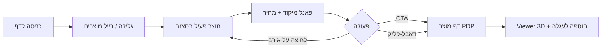

# OneClick Hub — מסמך עיצוב תלת-ממדי מלא / Master 3D Design

> **מסמך יישום** לחנות OneClick Hub. ממפה את חזון האפיון לקוד Hydrogen הקיים (Shopify + React Router + R3F + GSAP + Zustand).  
> **לא Next.js** — הסטאק בפועל הוא Hydrogen 2026 על Vite; כל ההנחיות כאן מיועדות לשילוב ב-`app/` הקיים.

---

## 1. חזון / Vision

| יעד | יישום |
|-----|--------|
| חנות מהמובילות בעולם | חוויית גילוי קולנועית + checkout Shopify מוכח |
| קנבס מלא | `ImmersiveHome` + `layout--immersive` — HTML שקוף מעל WebGL |
| חלק ומהיר | Lazy load, DPR מוגבל, Draco, WebP, צללים off בנייד |
| שילוב Shopify | Storefront API, מלאי אמיתי, עגלה, PDP |
| Zustand גלובלי | `useSceneStore` — scroll, מוצר פעיל, mobile, reduced-motion |

---

## 2. שפה חזותית — Pixar Studio

### עקרונות

- **צורות**: `RoundedBox`, רדיוסים גדולים, ללא קצוות חדים
- **תאורה**: key חם + fill רך + `Environment preset="studio"` + `ContactShadows` (דסקטופ)
- **צבע**: רקע `#f4efe8`, ערפל `#f4efe8`, הדגשות זהב (`--color-accent`)
- **מוצרים**: טקסטורת תמונה WebP על אורב / GLB Draco כשקיים
- **UI**: זכוכית מט (`backdrop-filter`), טיפוגרפיה display, צללים מכוונים למוקד

### טוקנים (CSS)

```css
--experience-bg: #f4efe8;
--experience-glass: rgba(255, 252, 247, 0.72);
--experience-shadow-deep: 0 4px 24px rgba(26, 24, 20, 0.08);
--experience-radius: 1.25rem;
```

### מיפוי קבצים

| אלמנט עיצוב | קובץ |
|-------------|------|
| תאורת סטודיו | `app/components/scene/StudioStage.tsx` |
| אורב מוצר | `app/components/scene/ProductOrb.tsx` |
| מודל GLB | `app/components/scene/ProductModel.tsx` |
| מצלמה קולנועית | `app/components/scene/CameraRig.tsx` |
| שכבת HTML | `app/components/experience/ExperienceOverlay.tsx` |
| סגנונות | `app/styles/experience.css` |

---

## 3. אינטראקציה ואנימציה

### זרימת גילוי (Discovery loop)



| אינטראקציה | התנהגות | ספרייה |
|------------|---------|--------|
| גלילה | מצלמה + סיבוב אורבים | GSAP ScrollTrigger → `useSceneStore` |
| לחיצה על אורב | **מיקוד** (לא ניווט מיידי) — אשליית שליטה | R3F events + `3d_orb_focus` |
| דאבל-קליק | מעבר מהיר ל-PDP | `3d_orb_click` |
| רייל מוצרים | קפיצה למוצר בגלילה | `focusAtIndex` |
| CTA ראשי | ניווט ל-PDP | React Router |
| מעבר דפים | fade GSAP | `usePageTransition` |

### מיקרו-אנימציות (דופמין אתי)

- הגדלת scale באורב פעיל / hover
- כניסת פאנל מיקוד (GSAP `fromTo` על opacity + y)
- פעימת scroll-hint בתחילת הביקור
- תג מלאי נמוך **רק** כש-Shopify מדווח 1–5 יחידות

> **אתיקה**: לא מיישמים מניפולציות מטעות (מלאי מזויף, טיימרים כוזבים). המרה אגרסיבית = UX חלק, מיקוד ויזואלי, נתונים אמיתיים, מסלול קצר לקופה.

---

## 4. ארכיטקטורת שכבות

```
┌─────────────────────────────────────────────┐
│  Announcement + Header (שקוף, fixed)          │
├─────────────────────────────────────────────┤
│  ExperienceOverlay (HTML, pointer-events)   │
│    · כותרת · פאנל מיקוד · רייל · CTAs       │
├─────────────────────────────────────────────┤
│  SceneCanvas (WebGL, fixed)                 │
│    CameraRig · StudioStage · ProductOrbs    │
├─────────────────────────────────────────────┤
│  Scroll spacer (מניע ScrollTrigger)         │
└─────────────────────────────────────────────┘
         ▲                    ▲
         │                    │
   useGsapExperience    useSceneStore (Zustand)
```

### דפים

| דף | חוויית 3D | הערות |
|----|-----------|--------|
| דף בית | מלא — `ImmersiveHome` | `PUBLIC_3D_EXPERIENCE=1` |
| PDP | `ProductViewer3d` + OrbitControls | כשיש GLB |
| קולקציות | 2D (שלב 2: teaser 3D) | roadmap |
| עגלה / חיפוש | 2D | Shopify Hydrogen סטנדרטי |

---

## 5. ביצועים — תקציב

| מדד | יעד | אמצעי |
|-----|-----|--------|
| LCP | < 2.5s | lazy Canvas, SSR ללא WebGL |
| INP | < 200ms | אירועי pointer ממוקדים |
| מובייל | ללא קריסות | DPR≤1.5, shadows off, ≤8 אורבים |
| GLB | < 2MB למודל | Draco, preload לפי visibility |
| תמונות | WebP 512px | `optimizeShopifyImageUrl` |

---

## 6. מפת יישום לפי שלבים

### שלב 1 — גילוי מושלם (מיושם / בתהליך)

- [x] סצנת סטודיו Pixar
- [x] גלילה ↔ מצלמה
- [x] מיקוד לפני ניווט + רייל מוצרים
- [x] אנימציית פאנל מיקוד
- [ ] Quick Add מהפאנל (שלב 4)

### שלב 2 — עומק ויזואלי

- [ ] Post-processing עדין (bloom מוגבל, vignette CSS)
- [ ] פופאפ מוצר per-handle (metafield `custom.experience_theme`)
- [ ] Collection hero 3D קל
- [ ] סביבת “חדר” procedural (רצפה מעוגלת, קירות רכים)

### שלב 3 — ביצועים מתקדמים

- [ ] Service Worker cache ל-GLB
- [ ] LOD / instancing מעל 8 מוצרים
- [ ] `requestIdleCallback` preload

### שלב 4 — מסחר immersive

- [ ] Quick add מהאורב
- [ ] עגלה slide-over מעל קנבס
- [ ] A/B immersive vs classic

---

## 7. הגדרות סביבה

```bash
# חובה לחנות אמיתית
SESSION_SECRET=...
PUBLIC_STORE_DOMAIN=smartclickhub.myshopify.com
PUBLIC_STOREFRONT_API_TOKEN=...

# חוויית 3D
PUBLIC_3D_EXPERIENCE=1
PUBLIC_BRAND_NAME=OneClick Hub

# אופציונלי — מודלים
# metafield custom.model_3d על מוצר
```

---

## 8. הפעלה מקומית

```bash
npm install --legacy-peer-deps
cp .env.example .env
# מלא tokens + SESSION_SECRET
PUBLIC_3D_EXPERIENCE=1 npm run dev
```

אם מופיע `storeDomain missing, defaulting to mock.shop` — החנות **לא** מחוברת; ראה `docs/oneclick-hub-3d-spec.md` ו-CI secrets.

---

## 9. בדיקות קבלה (Acceptance)

1. דף בית: קנבס מלא, גלילה חלקה, לפחות מוצר אחד בסצנה
2. לחיצה על אורב מעדכנת פאנל מיקוד **בלי** לעזוב את הדף
3. CTA / דאבל-קליק → PDP
4. רייל מוצרים מסנכרן גלילה + מיקוד
5. נייד: ללא צללים כבדים, fallback ל-2D אם אין WebGL
6. `prefers-reduced-motion`: גלילה native, ללא Float/GSAP scrub
7. מלאי נמוך מוצג רק מנתוני Shopify

---

## 10. קישורים

- [אפיון טכני קצר](./oneclick-hub-3d-spec.md)
- קוד: `app/components/experience/`, `app/components/scene/`
- אנליטיקה: `app/lib/experience-analytics.ts`

---

*OneClick Hub · Hydrogen · עודכן עם שלב 1 — גילוי אינטראקטיבי*
